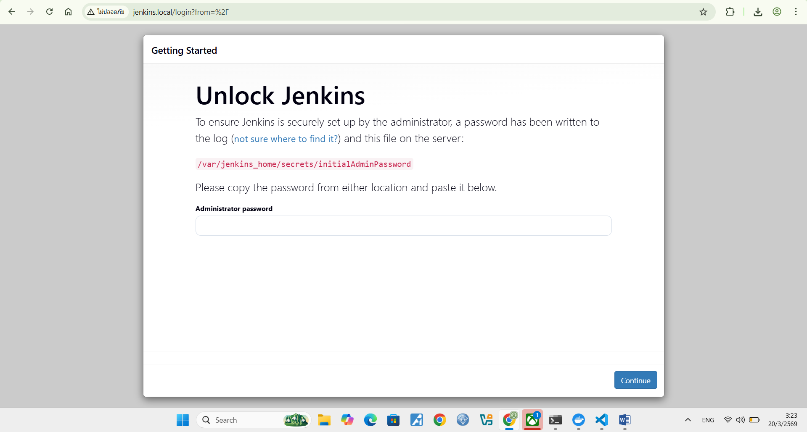
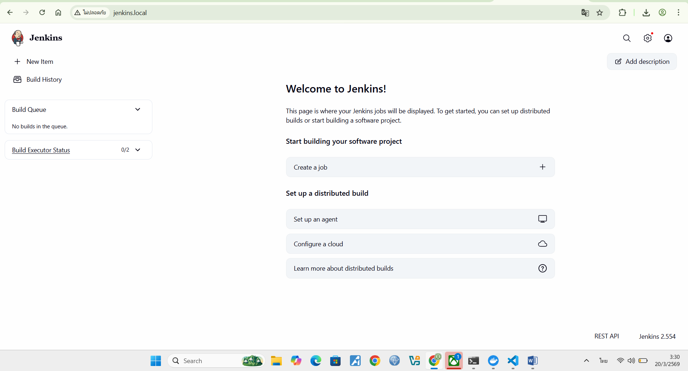
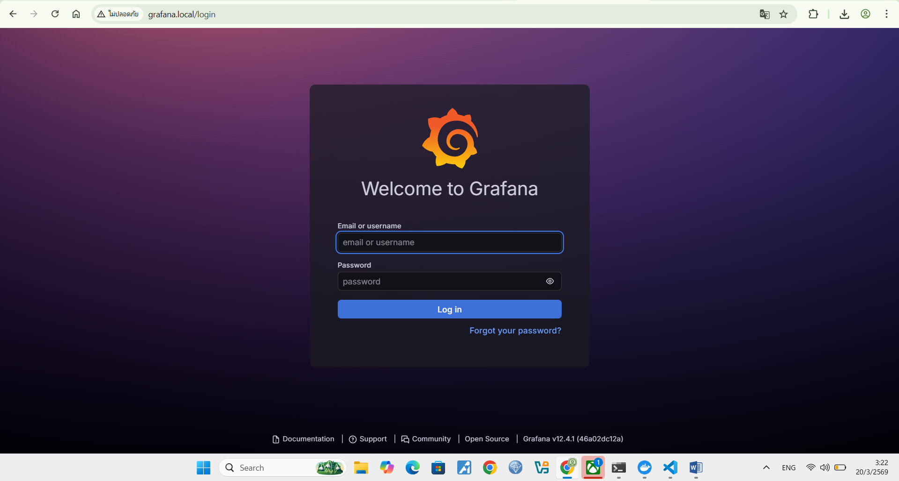
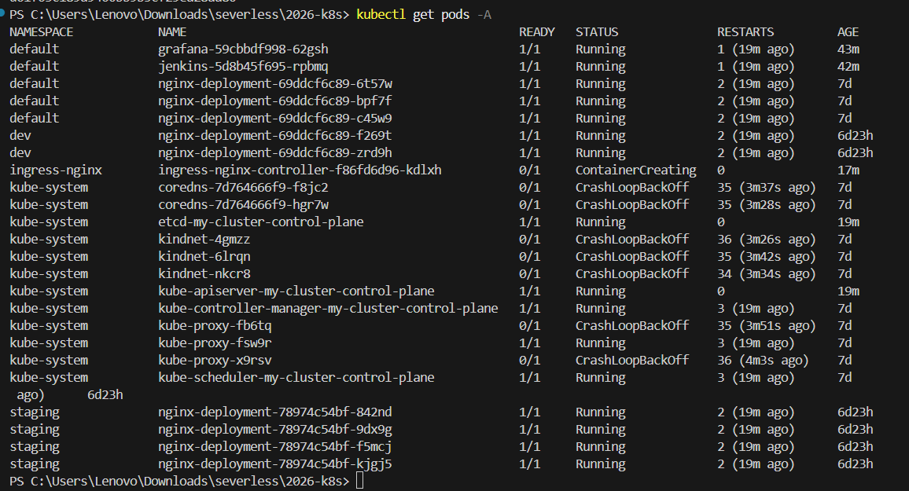
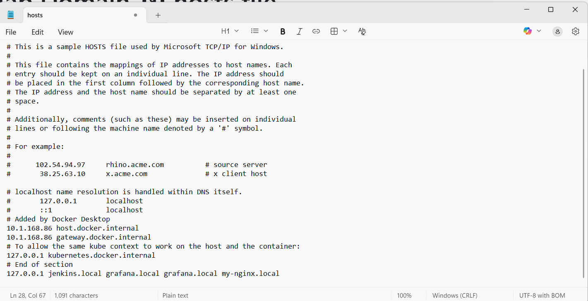

# Home work Week 4
1. Deploy Jenkins and Grafana on Kubernetes
2. Create GitHub repository and upload configuration files
3. Map domain in hosts file

### หน้า Jenkins Dashboard
แสดงหน้า Dashboard ของ Jenkins หลังจากติดตั้งสำเร็จ

 

### หน้าเข้าสู่ระบบ Grafana
แสดงหน้า Login ของ Grafana สำหรับระบบ Monitoring

### สถานะ Pod ใน Cluster
แสดงผลลัพธ์คำสั่ง `kubectl get pods -A`

## Map Domain ใน hosts file

